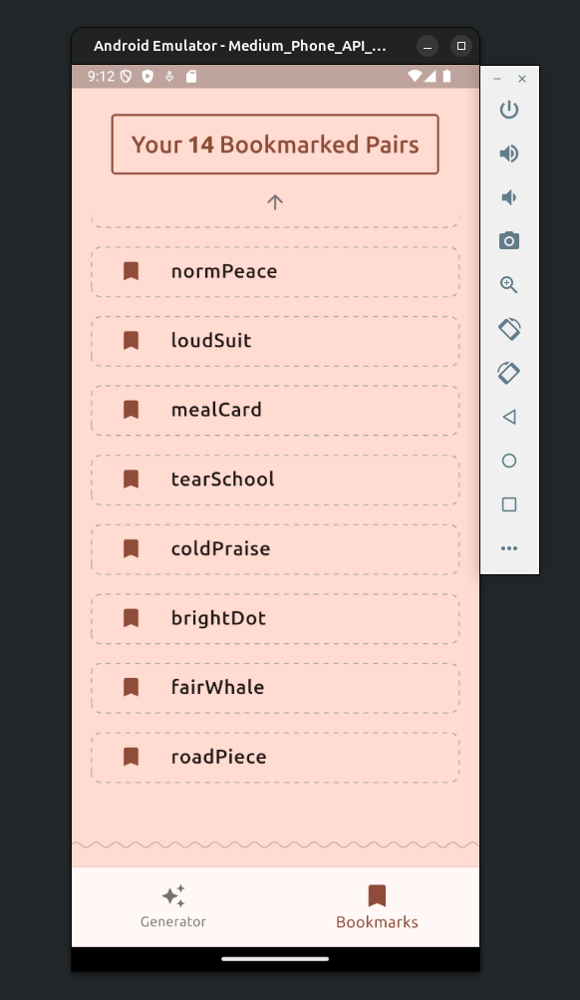
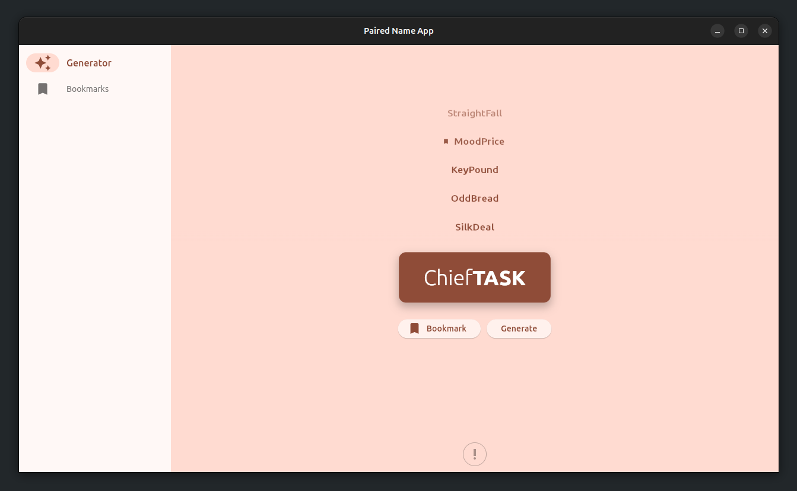

    بسم الله الرحمن الرحيم

# Paired Name App

A simple Flutter app for generating possibly interesting paired-word names!

It's nothing more than a development [training](https://codelabs.developers.google.com/codelabs/flutter-codelab-first) ground to see what could be achieved with Flutter nowadays (at the time of this writing)... **The idea is theirs, not mine.** However, from animation to state-management plus encryption and, most importantly, organization... That is ChatGPT's!

### Features

- Paired-words generator
- The ability to bookmark **interesting** ones
- Bookmarks are saved locally and securely

## Usage

### Android

1. Download from [Releases](https://github.com/GoodM4ven/APP_FLUTTER_paired_name/releases).
2. Allow "installing from unknown sources" in system options.
3. Install the app.
4. Run the app!

### Linux

1. Make sure the `libsecret` and `libjsoncpp` dependencies are installed.
2. Download from [Releases](https://github.com/GoodM4ven/APP_FLUTTER_paired_name/releases).
3. Execute `paired_name_app-linux-x64` to run the app.

## Development

- At first, I stuck to the Provider state-management approach, and then migrated everything to Riverpod
- Minimized the organization of the project files; avoiding as much OCD as Flutter leads to!
- Designed decent animations for pair generation and a bit more
- Filtered the pair generation flow with a custom blacklist
- Locally stored the data
- Encrypted the data

### Dependencies

The `-dev` libraries of `libsecret` and `libjsoncpp` are needed.

### Packages Used

- [english_words](https://pub.dev/packages/english_words)
- [riverpod](https://pub.dev/packages/riverpod)
- [flutter_secure_storage](https://pub.dev/packages/flutter_secure_storage)
- [hive_flutter](https://pub.dev/packages/hive_flutter)
- [rive](https://pub.dev/packages/rive) ✱
- [dotted_decoration](https://pub.dev/packages/dotted_decoration)
- [wave_divider](https://pub.dev/packages/wave_divider)
- [package_rename](https://pub.dev/packages/package_rename)
- [icons_launcher](https://pub.dev/packages/icons_launcher)
- [flutter_native_splash](https://pub.dev/packages/flutter_native_splash)

### Todos

- // TODO etc section or something for both about and settings, maybe
- // TODO orderable favorite bookmarks (drag and drop)
- // TODO bulk selection and removal in bookmarks
- // TODO having a helper for fading edges

- // TODO popping animation for removed bookmarks
- // TODO water drop animation sfx behind togglable bookmarks in recently generated
- // TODO side transitions for text and icon in recently generated togglables
- // TODO generate button animation
- // TODO fade in/out animations for scrolling arrows
- // TODO better bookmark button animation
- // TODO better recently generated list look

### Progress

You can also checkout the project's [roadmap](https://github.com/users/GoodM4ven/projects/4/).

## Support

Support ongoing package maintenance as well as the development of **other projects** through [sponsorship](https://github.com/sponsors/GoodM4ven) or one-time [donations](https://github.com/sponsors/GoodM4ven?frequency=one-time&sponsor=GoodM4ven) if you prefer.

And may Allah accept your strive; aameen.

### License

This package is open-sourced software licensed under the [MIT license](LICENSE.md).

### Credits

- [ChatGPT](https://chat.openai.com)
- [Filip Hráček](https://www.youtube.com/@filiphracek/videos)
- [Flutter](https://flutter.dev)
- [Riverpod](https://pub.dev/packages/riverpod)
- [Hive](https://pub.dev/packages/hive_flutter)
- [Google](https://google.com), somehow!
- All the dependency [packages](./pubspec.yaml) this package relies on...
- And the generous individuals that we've learned from and been supported by throughout our journey...

    والحمد لله رب العالمين

